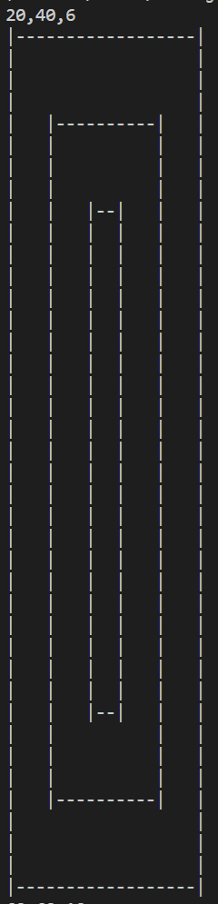
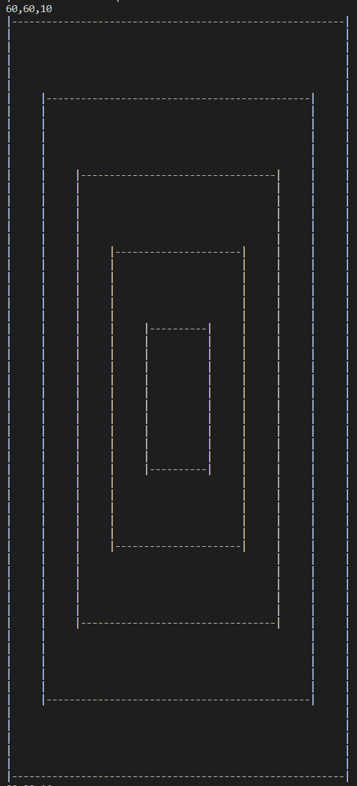
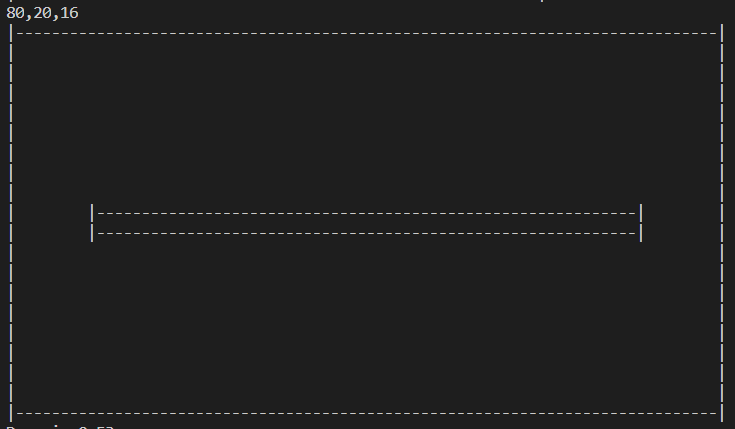

# Infinite shape
Infinite shape challenge [](https://travis-ci.com/amtb/infinite-shape)

## Algorithm
The implementation is not recursive, and the complexity is `O(n*2)`.

The shape looks like the following:

```
                       filled line
                 <------------------------>|
                                           |
                 +----------------------------------------------------+
             ^   |                         |                          |
padding lines|   |      <----------------> |                          |
             v   |                         |                          |
                 |      +--------------------------------------+      |
                 |      |                  |                   |      |
                 |      |     <----------> |                   |      |
                 |      |                  |                   |      |
                 |      |     +--------------------------+     |      |
                 |      |     |            |             |     |      |
                 |      |     |            |             |     |      |
                 |      |     |            |             |     |      |
                 |      |     |            |             |     |      |
          -------------------------------------------------------------------- symmetry axis
                 |      |     |            |             |     |      |
                 |      |     |            |             |     |      |
                 |      |     |            |             |     |      |
                 |      |     |            |             |     |      |
                 |      |     |            |             |     |      |
                 |      |     +--------------------------+     |      |
                 |      |                  |                   |      |
                 |      |                  |                   |      |
                 |      +--------------------------------------+      |
                 |                         |                          |
                 |                         |                          |
                 |                         |                          |
                 |                         |                          |
                 +----------------------------------------------------+
                                           |
                                           |
                                           |
                                 symmetry axis

```

- padding lines are the same as the previous filled line with dashes replaced by empty spaces.

The goal was to build that top left quarter of the shape and mirror it (twice).
To build the top left quarter, we:
- build filled lines reduce in size as we go in depth (reduce the width by padding each iteration)
- add padding lines as long as the filled lines are not empty
- and handle last iterations / corner cases.

## Pre-requisites
- Node.js <br/>
The famous one https://nodejs.org/en/

- Yarn <br/>
Alternative/Challenger to `npm`, see https://yarnpkg.com/lang/en/

## Install guide
- Clone the repository
- Install the dependencies using `yarn`
- Build the application using `yarn run build`
- Start the application using `yarn run start`

## Testing
Once the install guide is followed
- Run the unit tests using `yarn run test`
- Open the `index.html` file inside the `test-report` folder to see the report.

## Development guide
- Use `yarn run test:watch`

You can also launch it from VSCode using the Jest All button in the Debugger menu.

## Screenshots
### 20-40-6


### 60-60-10


### 80-20-16



